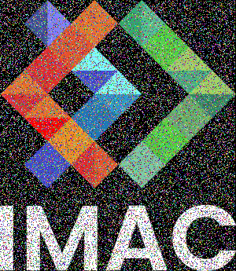
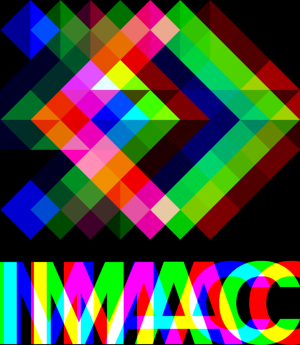
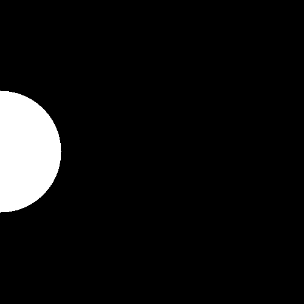
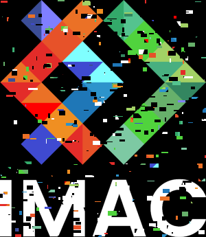
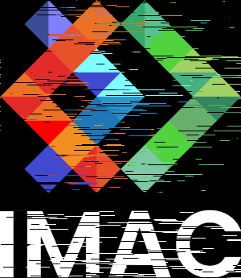
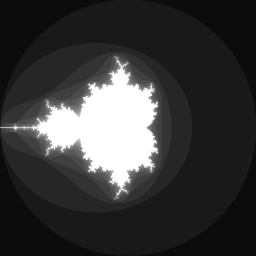

# 🐣 S1 | Prog: Workshop

## ⭐ Ne garder que le vert

J'ai enlevé les couleurs rouges et bleu des pixels.


## ⭐ Échanger les canaux

Échange des canaux rouge et bleu.


## ⭐ Noir & Blanc

On calcul le noir et blanc avec la formule.

```
0.3 * R + 0.59 * G + 0.11 * B
```


## ⭐ Négatif

J'ai fais 1 - la couleur


## ⭐ Dégradé

J'ai calculé la proportion de x en fonction de la taille de l'image


## ⭐⭐ Miroir

J'ai copié l'image dans une variable pour la sauvegarder et j'ai modifié l'image en prenant en prenant les points opposés avec l'image copié


## ⭐⭐ Image bruitée

J'ai mis une probabilité de 30% que le pixel soit modifié par une couleur aléatoire




## ⭐⭐ Rotation de 90°

Il faut penser au changement des axes x et y


## ⭐⭐ RGB split

Il faut faire attention au bordures et verifier qu'on peut bien prendre la couleur.




## ⭐⭐ Luminosité

Il faut utiliser les puissances sur les valeurs rouges, vertes et bleues.


## ⭐⭐(⭐) Disque

Il faut utilisé la formule d'un disque et vérifier si le point est dedans.


### ⭐ Cercle

On créer un petit cercle et on verifie que les points soient au-dessus.


### ⭐⭐ Animation

On boucle pour créer 25 images et on créer le gif.



### ⭐⭐⭐ Rosace

On utilise des formules tigonométrique et on boucle pour créer tous les cercles.


## ⭐⭐ Mosaïque

On copie l'image 5 fois en décalant x et y par la taille de l'image.


## ⭐⭐⭐⭐ Mosaïque miroir

Quand le modulo vaut 1, alors on est sur une case impair et on change le comportement.


## ⭐⭐⭐ Glitch

Il faut bien penser à prendre une image de référence.




## ⭐⭐⭐ Tri de pixels

On fait le tri en fonction de la brightness de la couleur et il faut bien penser à multiplier l'index aléatoire par y \* la taille de l'image




## ⭐⭐⭐(⭐) Fractale de Mandelbrot

La principale source de problème était de bien penser à diviser par des float et de trouver la formule de conversion des intervalles.



## ⭐⭐⭐(⭐) Dégradés dans l'espace de couleur Lab

Il faut bien penser à faire le mix une fois qu'on est passé à OkLab, puis repartir sur du srgb.


## ⭐⭐⭐(⭐) Tramage

Il faut bien pensé à revenir au grayscale vu que l'image est en couleur.


## ⭐⭐⭐(⭐) Normalisation de l'histogramme

On récupère le min et le max de la luminosité et on adapte l'intervale à [0, 1].


